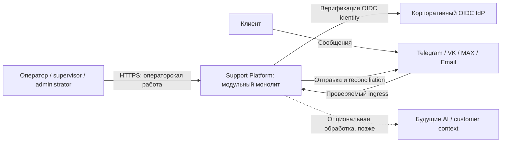
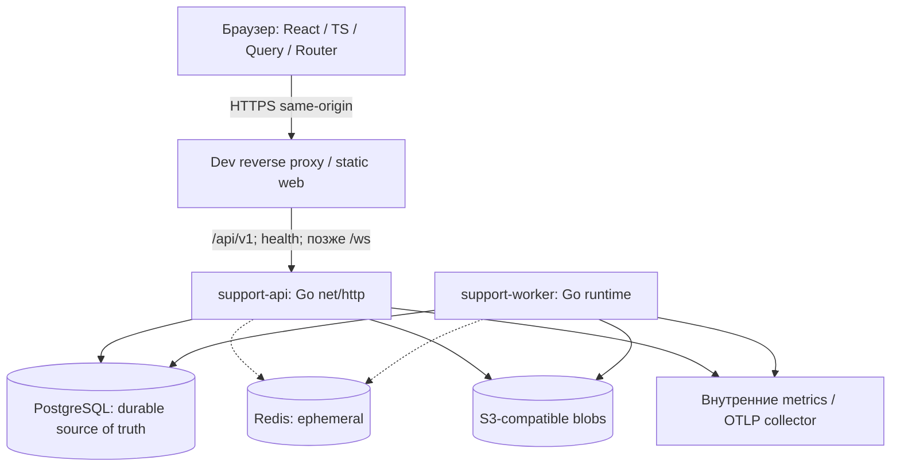
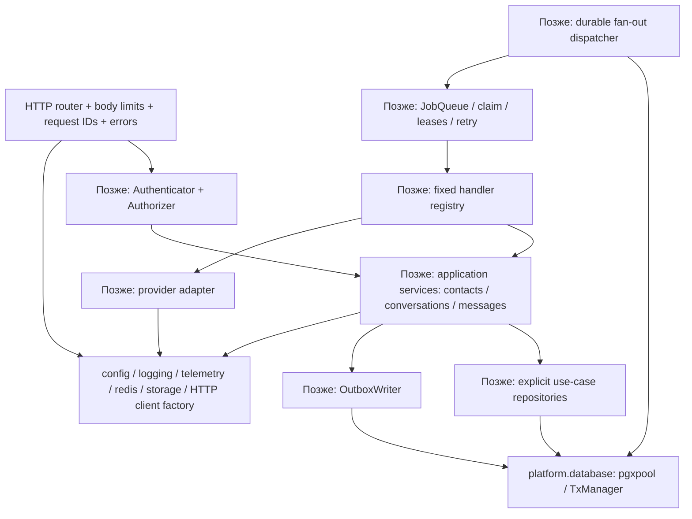

# Архитектура платформы и первого этапа

Статус: ready_for_review  
Дата: 2026-09-10  
Владелец: Архитектор  
Основание: `spec/README.md`, SPEC-000/010/020/030; подробные пробелы — [RND.md](RND.md).

## Статус утверждений

«Требование» ниже означает правило из исходных spec, переданных пользователем. «Предложение» требует review/решения перед соответствующим downstream этапом. На первичном обследовании runtime-код и тесты отсутствовали; схемы описывают целевую архитектуру, не развёрнутую систему. ARCHITECTURE не подтверждает production/dev readiness. В этом этапе production-код не изменяется.

## C4 Context

Каналы и optional-компоненты показаны как future scope. SPEC-000 запускает технические процессы без authentication/domain/provider integration. AI не должен участвовать в критическом пути сохранения/отправки (AR-006). Запрошенная миграция к GPT-6 Astra не даёт основания добавлять выдуманный API model ID в приложение; model migration/evals планируется отдельно после подтверждения контракта.

## C4 Container

Edge — предложение deployment layout, точная конфигурация зависит от обследования dev-host. API и worker — два бинарника одной системы, без внутреннего HTTP между доменами. Redis outage не теряет jobs/messages. На foundation у PG только migration bookkeeping. Внутренние БД/Redis/MinIO endpoints не публикуются на внешнем интерфейсе remote-host; доступ к dev UI до auth — через ограниченный доступ/SSH tunnel или контролируемый edge policy. Документ не утверждает наличие настроенного TLS/DNS.

## C4 Component

Foundation реализует platform, binaries, HTTP conventions, health и frontend skeleton. Domain packages не импортируют router/SDK provider types; передаются нормализованные контракты. `Authenticator` — boundary interface с HTTP request, не доменный entity. Generated HTTP DTO не становится доменной моделью.

## Контракты и владение

| Контракт | Владелец / граница | Гарантия и запрет |
|---|---|---|
| `/health/live`, `/health/ready` | platform HTTP; OpenAPI 3.1 | Live без external calls; PG failure → ready non-2xx; никаких connection strings |
| `/api/v1` + standard Error | HTTP layer | Стабильный code/message/details/request_id; позже default authenticated, отдельные public exceptions |
| `TxManager.WithinTx(ctx, fn(tx))` | application-owned boundary | Один DB tx; commit error возвращается; rollback на неуспех; repositories не начинают business tx |
| `ObjectStore.Put/Get/Delete/PresignGet/Health` | platform.storage | Context/timeout, streaming close ownership; presign TTL ограничен, авторизация будущего attachment use case до выдачи URL |
| `Authenticator.Authenticate` / `Authorizer.Allowed` | SPEC-010 | Проверенная issuer+sub, local role/status, disabled reject на следующем запросе, resource scope отдельно |
| `NormalizedInboundMessage` | adapter → core | Provider-neutral payload, нормализованные keys; ни credentials, ни provider SDK объектов |
| `ChannelAdapter.Send` | worker → adapter | Stable MessageID/idempotency key; timeout не означает definitely not sent |
| `OutboxWriter.Append(ctx, tx, events...)` | core → durable infra | Domain mutation+event в одном tx; event IDs/correlation/causation; no direct Redis publish |
| `StoreAndEnqueue` | verified ingress → inbound infrastructure | durable raw event + job атомарны; ack только после commit; duplicate подтверждает существующее событие |
| `JobQueue.Enqueue(ctx, tx, req)` | application → jobs | DB durability; active dedup лишь оптимизация; uniqueness event+handler для fan-out |
| `EventHandler.HandleEvent(ctx, tx, event)` | wrapper → DB consumer | receipt+effects один tx, повтор не повторяет effect; не распространяется на external network effect |

Формат Event требует единой версии контракта в `internal/events`; вторую несовместимую копию в jobs/core не создавать. Attachment ref types до SPEC-040 могут быть лишь минимальными opaque identifiers, без неутверждённой upload логики. API auth pagination/errors и точные read-state/idempotency semantics ещё уточняются в GAP-02..11.

## Trust boundaries

1. **Браузер → HTTP:** любой input недоверен, включая request ID, role/user ID и HTML. Body limit/timeouts/CORS обязательны; later principal строится из validated identity. Health/metrics не раскрывают secret config. Cookie transport требует CSRF, bearer требует reviewed storage; выбор пока не утверждён.
2. **IdP → local account:** подпись/issuer/audience/time/JWKS проверяются; claims не дают роли. Локальная запись и disabled статус авторитетны. Unknown subjects fail closed. Первый администратор provisioning оформляется отдельно.
3. **Provider → ingress:** verify raw body signature до persistence; allowlist headers, dedup key от адаптера; только после commit успешный ack. Payload с PII имеет retention; credentials не попадают в payload/error/log.
4. **Application → PostgreSQL:** параметризованный SQL, explicit tx, FK/unique и application invariants. Миграционные права отделить от runtime где инфраструктура позволяет. Cross-table ссылки и actor проверяются до mutation.
5. **Worker → provider/S3:** общий bounded HTTP client, TLS verification, safe redirect policy. Ссылки из сообщений не дают произвольного сетевого доступа; SSRF/download правила определяются attachments/channel specs до загрузки.
6. **Runtime → telemetry:** bounded labels, redaction, без cookies/auth/message bodies/DSN. Exporter failure не останавливает messaging.
7. **CI → удалённый dev:** deployment identity/host key проверяются; secret storage CI/host, не Git. Пользователь разрешил root SSH с указанным ключом, но контейнеры приложения работают non-root. Key contents и host-wide config не включаются в документы/артефакты.

## Транзакции, конкурентность и failure modes

| Операция / сбой | Ожидаемое поведение | Проверка |
|---|---|---|
| Config secret отсутствует | Fail startup, только имя поля/код ошибки | Unit config и sentinel redaction; FR-FND-003/SEC-FND-001 |
| PG исчезает во время работы | Live 200, ready 503; timeout, без процесса restart loop по readiness | AC-FND-004, реальный stop/restart PG |
| Redis/S3 optional outage | Degraded отдельного check, без ложного ready отказа core | Foundation integration; feature-required policy отдельно |
| OTLP недоступен | Продолжение работы, bounded diagnostic | Telemetry failure unit/integration |
| API SIGTERM | Stop accept, bounded drain, close pool/clients, flush | Process test AC-FND-005 применительно к worker и §17 для API |
| Inbound duplicate race | Unique channel+dedup и channel+normalized external message key; один effect | AC-EVT-002/003, AC-CORE-005/006 |
| Первый thread без conversation | Lock identity row до select/create; один current candidate | Дополнительный PostgreSQL race тест GAP-04 |
| Domain write до commit падает | Message+conversation+outbox полностью rollback | F1/F2/F3; FR-CORE-003/004 |
| Commit произошёл, dispatch ещё нет | Outbox остаётся undispatched, later replay | F4; AC-EVT-010 |
| Частичный fan-out | Весь batch в tx; rollback либо unique event+handler | F5; AC-EVT-011 |
| Handler effects до receipt | Один tx, любая ошибка откатывает effects | F6; DATA-EVT-004 |
| Handler commit до job complete | Replay receipt → no-op | F7; AC-EVT-012 |
| Request передан провайдеру, ответа нет | Ambiguous outcome; durable send attempt + reconciliation later | F8 не решён generic queue; отдельные channel AC |
| Worker умер после claim | Lease expiry → bounded recovery; attempts exhausted → dead | F9; AC-EVT-005/008; GAP-12 |
| Stale worker завершает/продлевает | Guard id+status+owner+lease_token; 0 affected rows не success | AC-EVT-013, lease race |
| Shutdown с active handler | Stop claiming; finish within deadline или lease recovery | F10; AC-EVT-019 |

Не держать DB transaction открытой во время provider HTTP. Fencing job row не отменяет уже посланный HTTP и не обеспечивает exactly-once. Одновременные DB-only handlers должны конфликтовать/сериализоваться до видимых effects, с rollback всей проигравшей транзакции. Lock order выбрать единый: identity → conversation → message/operational rows; ошибки deadlock/serialization имеют bounded retry на application boundary.

## ADR в рамках этого артефакта

ADR встроены в этот файл, поскольку владельцу поручены только RND.md и ARCHITECTURE.md. `PLANS.md`, исходные spec и production-код не изменяются.

### ADR-ARCH-001 — сохранить модульный монолит

Статус: подтверждено исходными AR-001/ADR-FND-001. Решение: два Go binaries + web, shared modules/PG, без новых network services. Альтернатива microservices отклонена spec. Последствия: единый schema/version rollout; scaling API/worker отдельно; модульные import-boundary tests.

### ADR-ARCH-002 — durable state в PostgreSQL

Статус: подтверждено AR-002/004/005, ADR-EVT-001..005. Решение: business tx/outbox, queue leases, handler receipts; Redis ephemeral. Альтернатива Redis queue нарушает durability requirement. Последствия: PG connection budget/индексы/maintenance обязательны; внешнее exactly-once не обещается.

### ADR-ARCH-003 — выполнение 020 и 030 с общим durability gate

Статус: предложение для review оркестратором. Контекст: 020 требует реализацию интерфейса из 030. Решение: pure domain/event contracts и unit tests 020; минимальный PostgreSQL outbox writer slice 030; integration core; затем весь queue/dispatch runtime 030. Альтернатива: закончить весь 020 с заглушкой — не удовлетворяет FR-CORE-004 и отвергается. Альтернатива: переопределить зависимости/spec границы целиком — больше документационных изменений. Последствия: частичная реализация допустима, статус done только после общего durable gate.

### ADR-ARCH-004 — наблюдаемость и readiness foundation

Статус: безопасное уточнение для review. Решение: PG mandatory; Redis/S3 individually reported и optional, пока enabled feature не требует их; live без network; metrics внутренние, timeouts bounded, JSON logs с redaction. Основание FR-FND-008/009, §12/16/18–21. Альтернатива общий health по всем зависимостям создаёт каскадные отказы и противоречит degraded semantics. Последствия: deployment обязан отличать liveness и readiness; exporter failure не вызывает shutdown.

### ADR-ARCH-005 — auth transport и provisioning

Статус: открыто до SPEC-010. Предпочтение: same-origin server session, OIDC Authorization Code/PKCE, HttpOnly/Secure cookie и CSRF; альтернатива bearer token в памяти браузера с reviewed login/refresh. Нельзя молча выбрать frontend persistent localStorage или auto-provision. Требуются issuer/audience, callback/domain, первое admin mapping и security review. Решение не блокирует foundation.

## Миграция и rollout

Foundation стартует с пустой app DB: ordered migrations только bookkeeping, без таблиц бизнеса (AC-FND-012). Предлагаемая delivery sequence: locked dependencies → test/race/static/contract/integration → immutable artifact tagged commit → сериализованный dev deploy → явный migrate-up → start API/worker/web → bounded ready/live smoke → record release SHA. Если схема несовместима, сначала expand/совместимый application, backfill и лишь позднее contract; не применять destructive down автоматически.

До dev deploy подтвердить существующие workloads/порты/диск/runtime, выделить отдельный project namespace и volume; не применять host-wide prune/restart. Deploy secrets и private key не входят в artifact. Migration command один на release; несколько API replicas не запускают конкурентные auto-migrations. Реальная host inventory/CI platform выводятся оркестратором по fresh evidence, не следуют из этой схемы.

SPEC-010 добавляет users; SPEC-020 core enums/tables; SPEC-030 durable event tables. Для каждого: empty DB + previous-schema forward test, required uniqueness duplicate preflight, schema lock/операционное окно для больших таблиц. `ON DELETE CASCADE` и retention проверяются вместе, чтобы удаление receipt не разрешило повторный эффект. При смене handler registry до rollout определить replay/backfill semantics.

## Rollback

На foundation откатить deployment к последнему проверенному immutable artifact и прежней конфигурации без удаления volumes. Fresh first deploy без предыдущего релиза: остановить только новый app stack, сохранить БД/логи/artefacts для расследования. При readiness failure не продолжать deployment бесконечно.

Application rollback допустим только при совместимости предыдущего binary со схемой. `migrate-down` выполняется явно лишь для доказанно безопасной обратимой миграции; destructive schema rollback не является автоматическим recovery. При частично выполненной миграции — остановить rollout, определить фактическую migration version, предпочесть исправляющую forward migration. Backup/restore требует проверенного восстановления и допустимой потери данных; его наличие этим документом не подтверждено.

Worker rollback останавливает новые claims, оставляет незавершённое lease recovery; downgrade не должен терять известные handler names/payload versions. External F8 effects не откатываются SQL rollback и требуют reconciliation.

## Проверка и передача

Для foundation нужны AC-FND-001..012, unit config/redaction/error mapping, real PG/Redis/MinIO integrations, process shutdown, frontend build/test/typecheck/lint, OpenAPI invalid-schema negative test, race и secret sentinel. Изменённые production строки проверяются независимым Reviewer и QA; требование покрытия ≥80% и отсутствие уменьшения общего покрытия оцениваются по отчёту реализации, а не утверждаются заранее.

Открытые решения GAP-02/03/05/06/07 должны быть согласованы до downstream бизнес-реализации. Текущий next role: Разработчик для SPEC-000 в рамках утверждённого PLAN/AC; затем независимый Ревьювер и QA. Данная архитектурная стадия не является завершением всего пользовательского проекта.
