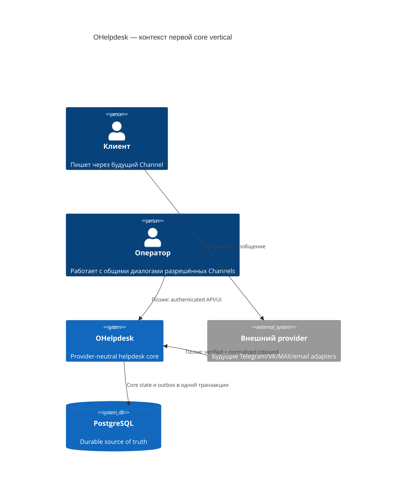
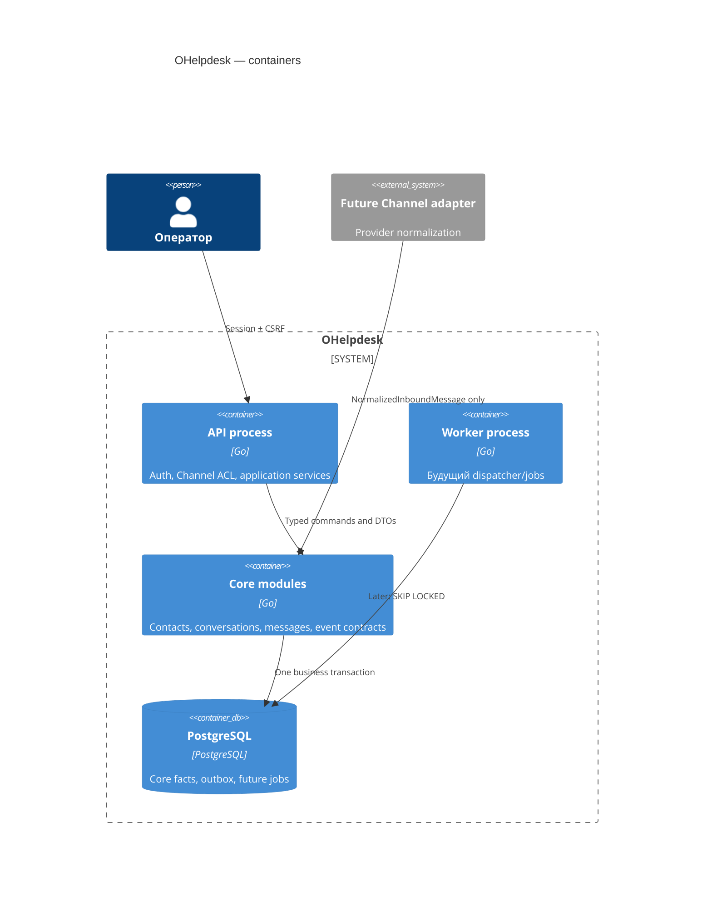
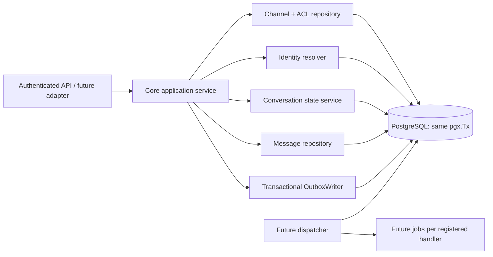

# Архитектура: Core Domain + PostgreSQL outbox, первая vertical

Статус: `ready_for_review`. Дата: 2026-09-10. Владелец: Архитектор.

## Основание и scope

Источник: SPEC-020, SPEC-030, [RND.md](RND.md),
[BUSINESS_ANALYSIS.md](BUSINESS_ANALYSIS.md), [DECISIONS.md](DECISIONS.md) и
checkout. В checkout подтверждены `database.Pool.WithinTx`, checksummed
migrations и глобальные SPEC-010 permissions (`conversation.read`,
`conversation.reply`, `conversation.reassign`). Core tables, core modules и
outbox ещё отсутствуют. Это target contract, а не доказательство runtime.

Первая vertical принимает уже нормализованный `NormalizedInboundMessage` для
предварительно созданного Channel, создаёт/находит ContactIdentity и current
Conversation, сохраняет immutable inbound Message, применяет waiting/status
правила и вместе с ними пишет PostgreSQL outbox event. Webhook parsing,
provider send, inbox UI, SLA/analytics, queue routing и worker dispatcher не
входят в срез.

Утверждены следующие продуктовые решения:

1. `assignee_id` — операционная ответственность, не ACL. Любой агент с
   Channel-доступом читает/отвечает в диалоге; подпись агента добавится в тело
   email на этапе канала, а внешний account один.
2. Resolve требует `expected_version`; inbound после взятия lock всегда
   открывает Conversation.
3. SLA-время серверное/DB, хранится как timezone-aware instant и отображается
   в `Europe/Moscow`; provider time — отдельный описательный атрибут.
4. `sent -> failed` восстанавливает waiting только когда именно это Message
   всё ещё закрывает current waiting episode.

## C4 model

### Context



### Containers



### Components and package boundaries



```text
internal/channels/core      Channel contracts/config DTO and Channel ACL
internal/contacts           Contact and ContactIdentity resolution
internal/conversations      lifecycle, expected version, read state
internal/messages           immutable facts and delivery transitions
internal/events             versioned event contract
internal/events/outbox      PostgreSQL writer; dispatcher later
internal/coreapp            transaction-owning application services
```

Core must not import provider packages or SDKs. `internal/channels/telegram`,
`vk`, `max`, `email` may only implement adapter contracts later. The API and
adapter boundary validates/unmarshals untrusted data before it becomes a typed
command. Raw payload, headers, credentials and provider models cannot enter
core entities or event payloads.

The service owns the transaction; its repositories and writer receive one
`pgx.Tx` and never commit independently:

```go
type TxManager interface {
    WithinTx(context.Context, func(context.Context, pgx.Tx) error) error
}
type OutboxWriter interface {
    Append(context.Context, pgx.Tx, []events.DomainEvent) error
}
type ReceiveInboundService interface {
    ReceiveInbound(context.Context, NormalizedInboundMessage) (ReceiveResult, error)
}
```

Construction with a no-op outbox writer is invalid in runtime. PostgreSQL is
the durable source; Redis may not replace it.

## Data model and integrity constraints

Implement SPEC-020 §§9–10 unchanged as migration `000003_core_outbox` (or the
next ordered free version) registered in the existing checksum migrator. Do
not edit applied migrations 1 or 2. Migration explicitly enables the UUID
facility it uses (`pgcrypto` or equivalent), avoiding hidden host assumptions.

| Object | Required constraint |
|---|---|
| `channels` | Spec enum type/status, enabled flag and provider-neutral config. Credentials remain encrypted adapter/config data; core never decodes them. |
| `contacts` / `contact_identities` | `contacts.internal_customer_id` unique only when set; ContactIdentity unique `(channel_id, external_user_id)`, nonempty external user ID. Email/phone are not merge keys. |
| `channel_memberships` | New resource ACL: `(channel_id,user_id)` PK plus finite `can_read`, `can_reply`, `can_reassign` capabilities. Access needs global RBAC and this membership. |
| `conversations` | UUID + display-only sequence number; `version >= 1`; nonempty `external_thread_id`; `timestamptz` lifecycle fields. Add `is_current boolean NOT NULL DEFAULT true` and partial unique `(channel_id, external_thread_id, contact_identity_id) WHERE is_current`. It prevents duplicate current threads while allowing historical ones. |
| `messages` | Existing partial unique `(channel_id, external_message_id)`; immutable identity/content/direction/thread fields; only delivery metadata changes. Agent actor FK/check and inbound `received` check follow SPEC-020. |
| `conversation_read_states` | `(conversation_id,user_id)` PK and ordering by `(created_at,id)`, not timestamp alone. |
| `outbox_events` | SPEC-030 table plus `payload_version smallint NOT NULL DEFAULT 1`; undispatched and aggregate indexes. |

Service code verifies cross-table channel equality: Conversation channel equals
identity channel; Message channel equals Conversation channel. These checks
are proven by integration tests. No hidden trigger is introduced; one would
need an ADR because it would conceal business logic.

For DEC-020-04, add `waiting_closed_by_message_id uuid REFERENCES messages(id)`
to Conversation. This creates an explicit proof of which sent reply closed the
episode; inferring it from timestamps is unsafe.

## Transaction, lock order and missing-row races

`CoreApplicationService.ReceiveInbound` calls `WithinTx` and succeeds only
after commit. Its fixed sequence is:

1. Lock/read Channel and require `enabled=true`, `status=active`. Operator
   commands also check global permission and lock/read `channel_memberships`
   inside this transaction.
2. Take an xact advisory lock for canonical `(channel_id, external_message_id)`
   and find the existing Message path before any identity or Conversation
   mutation. A match returns the canonical Contact, Identity, Conversation and
   Message IDs with no state or outbox write.
3. Take an xact advisory lock for canonical `(channel_id, external_user_id)`;
   select ContactIdentity `FOR UPDATE`. If absent, create Contact and identity.
   The unique index is the final backstop. On `ON CONFLICT DO NOTHING`, re-read
   the winning identity and remove the newly-created unreferenced Contact, or
   roll that attempt back to a savepoint.
4. Take an xact advisory lock for canonical `(channel_id, external_thread_id,
   contact_identity_id)`; select current Conversation `FOR UPDATE`. If absent,
   insert it. If the partial unique index detects legacy/external contention,
   re-read the winner `FOR UPDATE`.
5. Insert Message, apply the Conversation transition, increment version, and
   append domain events through the same `pgx.Tx`.
6. Commit. Any repository, validation or outbox error rolls back every core and
   outbox write.

The lock order for every core mutation is **Channel/membership → message
idempotency advisory → existing Message path → identity advisory →
ContactIdentity row → conversation advisory → Conversation row → outbox rows**.
No code acquires a lower-order lock later. `FOR UPDATE` cannot protect an absent
Conversation, hence the advisory conversation key and partial unique index are
both required. A PostgreSQL deadlock or serialization failure is a typed
retryable infrastructure error; only the application boundary may retry it,
bounded and only for an idempotent command.

Resolve locks the Conversation and writes with `WHERE id=$1 AND
version=$expected_version`. If inbound already incremented it, Resolve returns
`version_conflict`, UI re-reads, and the new customer message cannot end
resolved silently.

## Time and state contract

All persisted domain time is `timestamptz`; API/UI present it in
`Europe/Moscow`. Core retrieves one PostgreSQL `clock_timestamp()` immediately
before its final writes and calls it `mutation_time`; Message, Conversation and
outbox `occurred_at` share it. PostgreSQL cannot persist the unknowable physical
end of COMMIT, so this is the atomic database meaning of «момент сохранения/
ответа», never client or provider time.

- First customer inbound sets `waiting_since=mutation_time` only if NULL;
  later inbound does not shift it. Inbound opens pending/snoozed/resolved and
  clears `snoozed_until`/`resolved_at`.
- Agent outbound starts `queued`. Only its first `sent` transition clears
  waiting, writes `first_response_at` once, and sets
  `waiting_closed_by_message_id`. AI/workflow/system, queued and failed do not
  answer.
- A late `sent -> failed` restores waiting only when this Message is still
  `waiting_closed_by_message_id` and no newer episode supersedes it; otherwise
  its delivery status changes without changing waiting.
- `last_activity_at=GREATEST(last_activity_at, mutation_time)`. Provider
  `external_created_at` remains descriptive and separate.

## Event and dispatcher boundary

An event is a committed fact, never a command or copy of message content. The
first vocabulary uses payload version 1:

| Event | Aggregate | Minimum payload without PII/content |
|---|---|---|
| `message.received` | Message | message, conversation, channel, identity IDs; direction, actor type, status, occurred_at |
| `conversation.opened` | Conversation | conversation/channel IDs, reason, version, occurred_at |
| `conversation.reopened` | Conversation | conversation/channel IDs, previous status, reason, version, occurred_at |
| `conversation.updated` | Conversation | conversation/channel IDs, finite change kind, version, occurred_at |
| `message.delivery_corrected` | Message | message/conversation IDs, from/to status, `waiting_restored`, occurred_at |

Every outbox row also follows SPEC-030: UUID, aggregate type/id,
`correlation_id`, optional `causation_id`, `dispatched_at`, `created_at`. New
required fields create a new payload version; consumers accept retained older
versions. Payload/logs/metrics cannot contain text, HTML, email, phone,
external user ID, raw provider response, headers, credentials or session data.

The later dispatcher claims undispatched events with `FOR UPDATE SKIP LOCKED`,
inserts one job per statically registered durable handler guarded by unique
`(event_id,handler)`, and sets `dispatched_at` only after those inserts succeed
in the same transaction. DB-only handler effect + receipt are one transaction.
External handlers are at-least-once; no DB transaction remains open during
provider HTTP, and provider idempotency/reconciliation is required.

## Authorization and errors

Access rule is: active authenticated user **and** global SPEC-010 permission
**and** capability of `channel_memberships` for Conversation Channel.
`assignee_id` never appears in this predicate or an inbox/reply filter.

| Condition | Result | Effect |
|---|---|---|
| Invalid input/enum/version | `validation_failed`, HTTP 400 | none |
| Missing global permission or Channel membership | `forbidden`, HTTP 403 | none; safe audit signal |
| Invalid state transition | `invalid_transition`, HTTP 409 | none |
| Stale expected version | `version_conflict`, HTTP 409 | none; current version safe to return |
| Duplicate external message | canonical success/result | no new rows/version/events |
| Reused outbound key with different request hash | `idempotency_conflict`, HTTP 409 | none |
| PostgreSQL timeout/unavailable/retry exhausted | `dependency_unavailable`, HTTP 503 or worker retry | no partial transaction |

Membership is checked inside write transaction, so a concurrent revocation wins
before mutation. Logs contain only opaque IDs, event type and stable error code.

## Migration, compatibility and rollback

1. **Expand:** add a new checksummed migration with enums/tables/indexes. Test
   empty DB and forward migration from current schema version 2.
2. **Deploy:** one serialized `migrate up`, then application with the real
   writer. Prove an inbound commit and an undispatched outbox row while worker
   is off.
3. **Compatibility:** later non-null fields use add/nullable/backfill/validate.
   Handler registry is deployed before dispatcher is enabled; payload version
   preserves old retained events.
4. **Rollback:** deploy rollback only while binary remains schema-compatible;
   preserve volumes and outbox facts. Never auto-run destructive down migration
   after facts exist. Partial migration uses corrective forward migration;
   restore needs separately proven backup/restore and an operational decision.

## Required RED/GREEN tests

1. Real PostgreSQL migration checks for constraints, FKs, partial uniques and
   checksum behavior.
2. Receive inbound creation/reuse, duplicate delivery, disabled Channel,
   pending/snoozed/resolved reopening, and injected rollback after every durable
   stage.
3. Two-connection races: first identity, absent current Conversation, duplicate
   Message, inbound vs stale Resolve. Assert exactly one canonical record and
   no orphan Contact.
4. Time-line tests for first/second inbound, queued/failed/AI replies, first and
   second sent agent reply, and both branches of late failure correction.
5. Channel membership tests: unassigned team member can read/reply; no
   membership cannot; assignment doesn't affect access; revocation vs write is
   denied safely.
6. Outbox atomicity/payload-redaction/dispatcher-off retention; SPEC-030
   follow-up tests fan-out duplicate guard, leases, receipts and crash recovery.
7. OpenAPI error/version contract before public endpoints, `go test -race`, vet,
   coverage gate, independent review and QA.

## ADRs and residual risks

### ADR-020-ARCH-001 — transaction-anchored creation locks

Accepted. Canonical PostgreSQL xact advisory locks protect identity and current
Conversation absence, followed by row locks and unique backstops. A row lock
cannot protect an absent row. Consequence: every writer follows the published
order and application retry remains bounded.

### ADR-020-ARCH-002 — Channel ACL, not assignee ACL

Accepted from DEC-020-01. `channel_memberships` plus global RBAC governs
visibility; assignment is routing/metrics data only. Consequence: membership
administration/seed path must exist before exposing operator endpoints.

### ADR-020-ARCH-003 — real minimal outbox before worker

Accepted from DEC-020-06. This vertical writes real PostgreSQL outbox events;
jobs/dispatcher are deferred but have a stable contract. Worker downtime forms a
durable backlog, and exactly-once external delivery is not claimed.

The main remaining risks are full SPEC-030 leases/receipts and provider adapter
idempotency not yet being implemented, operational validation of index/backup
behaviour on non-empty production data, and a need to provision Channel
memberships before user-facing conversation routes. Next role: BA/QA to write
full `ACCEPTANCE_TESTS.md`, then Developer creates RED tests and implementation.
