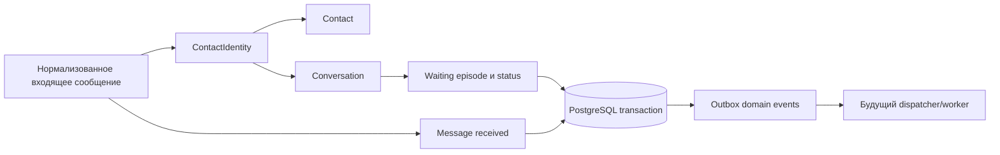

# Бизнес-анализ: Core Domain и durable outbox

Статус: `ready_for_review`.  
Дата: 2026-09-10. Scope: SPEC-020 и обязательная зависимость SPEC-030.

## As-is

Проект уже имеет foundation runtime и внутреннюю аутентификацию/RBAC из SPEC-010. В permission catalog присутствуют базовые conversation permissions, но core business entities, доменные миграции, outbox, jobs и сценарии helpdesk ещё не реализованы. Поэтому текущая система не способна принять сообщение клиента, сформировать контакт или thread, отразить ожидание ответа либо обеспечить его durable event trail.

PostgreSQL утверждён как source of truth. Redis не может стать единственным durable хранилищем событий или очередью. Внешние channel providers и их SDK не входят в core.

## To-be и бизнес-цель

После инкремента платформа хранит единый provider-neutral факт общения: кто написал, через какой Channel/identity, в какой Conversation, в каком статусе доставка и ожидает ли клиент успешного human response. Операторские действия меняют Conversation по явным правилам, а каждое committed изменение получает durable domain event. Это позволяет следующим спецификациям безопасно добавить worker, provider adapter, inbox, SLA и аналитические consumers без переписывания фактов core.

## Участники и ожидаемые outcomes

| Участник | Нужный outcome | Граница ответственности |
|---|---|---|
| Клиент | Его новое сообщение не теряется и не остаётся скрытым после snooze/resolve | Нормализация provider data предшествует core |
| Агент | Видит корректный lifecycle waiting/first response и может ответить без дублирования retry | Видимость и assignment должны быть утверждены отдельно |
| Supervisor | Меняет status/priority/assignee в пределах RBAC | Queues/routing — SPEC-100 |
| Administrator | Настраивает Channels вне provider credentials в обычных DTO | Управление реальными credentials остаётся adapter/config layer |
| Система/worker | Может асинхронно потребить committed event после рестарта | Exactly-once внешней отправки не обещается |

## Словарь

| Термин | Определение | Не следует смешивать с |
|---|---|---|
| Channel | Одна настроенная внешняя точка коммуникации | Provider SDK или глобальный provider account |
| Contact | Каноническое внутреннее представление клиента | Его account/username в конкретном Channel |
| ContactIdentity | Identity клиента в одном Channel | Глобально уникальные email/phone |
| Conversation | Операционный support thread для contact/identity/channel | Вечная копия external thread: возможны historical conversations |
| Message | Immutable content/author/thread плюс mutable delivery metadata | Доказательство успешного ответа клиенту |
| Human response | Outgoing Message от `agent`, достигшее `sent` или дальше | queued, failed, AI/workflow/system message |
| Waiting episode | Интервал от первого неотвеченного customer message до successful human response | Время последнего inbound message |
| Outbox event | Факт, committed с доменным изменением в одной transaction | Недолговечный Redis/PubSub notification |
| Job lease | Временное владение одной worker обработкой | Exactly-once delivery guarantee |

## Правила, исключения и состояния

### Identity и deduplication

- ContactIdentity является уникальной в `(channel_id, external_user_id)`. Один Contact может иметь разные identities в Telegram и VK; совпадающий external user ID между разными channels допустим.
- Email и phone не используются для автоматического глобального merge: это неverified third-party data.
- Внешний message ID уникален только внутри Channel. До channel specs адаптер обязан доказать/нормализовать его scope.
- При concurrent first inbound обработчик должен переиспользовать победившую identity, а не выдавать business failure.

### Conversation lifecycle

| Исходный статус | Команда оператора | Новое состояние | Входящее customer message |
|---|---|---|---|
| open | pending/resolved/snoozed | выбранное допустимое | остаётся open |
| pending | open/resolved/snoozed | выбранное допустимое | open |
| snoozed | open/resolved | выбранное допустимое | open, `snoozed_until=NULL` |
| resolved | open | open | open, `resolved_at=NULL`, event `conversation.reopened` |

Недопустимый transition возвращает stable domain error. Приоритет `low/normal/high/urgent` не меняет status. Snooze wakeup открывает conversation только когда она всё ещё snoozed и deadline истёк; он идемпотентен и требует scheduled job из SPEC-030.

### Waiting и response

1. Первый inbound customer Message начинает episode: `waiting_since=T`.
2. Последующие customer messages оставляют исходное `waiting_since`.
3. Outgoing agent Message начинает с `queued`. Неуспех и AI/workflow/system reply не прерывают episode.
4. Первый статус `sent` для agent Message очищает `waiting_since`, устанавливает `first_response_at`, обновляет activity timestamps и не должен перезаписать first response повторным reply.
5. Переход `sent→failed` после delayed provider correction требует отдельного выбранного правила; его нельзя реализовывать молча.

### Целостность и events

- Conversation.channel_id совпадает с ContactIdentity.channel_id; Message.channel_id совпадает с Conversation.channel_id.
- `actor_user_id` задан только для `actor_type=agent`; inbound имеет status `received`.
- `last_activity_at` не движется назад; version увеличивается с каждой business mutation.
- Message, Conversation и Outbox append commit/rollback вместе. Event payload содержит stable IDs и classification metadata, без полного текста/credentials.
- Dispatcher SPEC-030 создаёт job на каждый registered durable handler, используя `(event_id, handler)` как duplicate guard. DB-only consumer сохраняет effect и receipt одной transaction.

## Трассировка business rules в Given/When/Then

| Требование | Given | When | Then |
|---|---|---|---|
| FR-CORE-001, AC-CORE-006 | Две delivery одного нового sender приходят параллельно | Обе вызывают identity resolution | Создана одна ContactIdentity; проигравшая transaction reread-ит победившую запись |
| FR-CORE-002, AC-CORE-008/009 | Conversation snoozed/resolved | Приходит customer message | Status open; snooze/resolution marker очищен; создаётся нужный transition event |
| DATA-CORE-007/008, FR-CORE-005/006 | Есть несколько inbound и queued/failed/AI messages | Agent reply получает `sent` | `waiting_since` очищает только первый successful agent reply; `first_response_at` выставлен однократно |
| FR-CORE-003/004, DATA-EVT-003, AC-EVT-009/010 | ReceiveInbound выполняется с failure hook до commit либо worker недоступен | Business transaction завершается | При rollback нет core/outbox rows; при commit outbox event сохранён независимо от worker |
| FR-CORE-007/008, AC-CORE-018/019 | Один user уже использовал outbound idempotency key | Он повторяет same/different request | Same request возвращает один Message; different body — conflict, второго Message нет |
| DATA-CORE-009/010/011 | Есть конкурентные inbound и operator status commands | Они проходят transaction lock/version check | Идентичности/сообщения не дублируются, версия растёт атомарно, final status удовлетворяет утверждённой concurrency policy |
| DATA-EVT-002/004/005, AC-EVT-004/012/013 | Два worker или stale lease конкурируют за job | Claim/complete/replay происходят вокруг crash | Один active lease; stale completion отвергнут; DB-only consumer effect не повторён receipt-ом |

## Трассировка требований в вертикаль

| Vertical capability | SPEC-020 | SPEC-030 | Приёмка до перехода |
|---|---|---|---|
| Receive inbound atomically | FR-CORE-001..004; DATA-CORE-001..006,009 | DATA-EVT-003 | Concurrent identity/message tests + rollback after each transaction point |
| Waiting lifecycle | DATA-CORE-007/008; FR-CORE-005/006 | — | Golden time-line tests, including delayed callbacks |
| Operator mutation | §16/19/31/32/34 | — | Complete valid/invalid state table, RBAC and expected-version test |
| Durable committed fact | §28/29; SEC-CORE-003/004 | ADR-EVT-004, AC-EVT-009/010 | Real PostgreSQL outbox writer; worker-off committed-event test |
| Later durable fan-out | — | ADR-EVT-002/003/005; DATA-EVT-004/005 | Implemented in subsequent full SPEC-030 gate: leases, receipts, retry, recovery |

## Открытые вопросы для оркестратора и пользователя

Это решения, а не препятствия для чистых domain contracts/schema. До публикации operator endpoints и начала production implementation необходимо утвердить DEC-020-01..04 из [RND.md](RND.md): visibility/assignment policy, resolve-inbound concurrency, authoritative waiting clock и corrective behavior `sent→failed`.

Дополнительно архитектура должна выбрать единственный lock order: ContactIdentity → Conversation → Message/operational rows. Для отсутствующей Conversation блокировка самой таблицы не защищает creation race; serializing row должен быть уже существующий identity или application-level advisory lock с доказательным PostgreSQL test.

## Границы первого результата

Первый deliverable не является готовым helpdesk: у него нет webhook ingestion, реального provider send, inbox UI, attachments, queue routing, SLA и analytics. Он доказывает корректную durable модель, на которую эти функции опираются. Любой runtime shortcut, который заменяет PostgreSQL outbox fake writer-ом, нарушает целевой бизнес outcome и не проходит acceptance.
