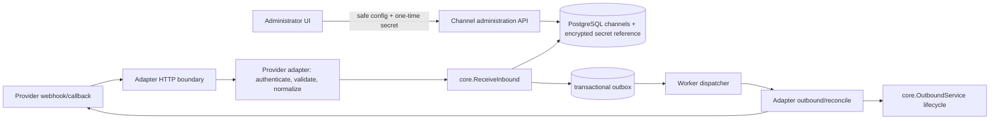

# Архитектура канальных adapters

Статус: `ready_for_review`.



## Module boundary

```text
internal/channels/admin/          safe Channel CRUD, validation and lifecycle
internal/channels/contracts/      provider-neutral Adapter, Capability and secret-port interfaces
internal/channels/telegrambot/    GoTd Bot API implementation
internal/channels/telegramuser/   GoTd MTProto user-account implementation with isolated session port
internal/channels/carrotquest/    API implementation after contract discovery
internal/channels/omni/           MTS Omni HTTP adapter
internal/channels/max/            MAX Bot API adapter
internal/channels/vk/             VK Messages/Callback API adapter
internal/channels/http/           narrow webhook routing; no provider structs in core/auth
internal/worker/                  outbox job consumer/dispatch orchestration
```

`core` accepts only `NormalizedInboundMessage` and provider-neutral outbound lifecycle commands. Provider modules own request DTOs, signature/token validation, pagination/status polling and translation to normalized values.

## Provider-neutral contracts (target)

```go
type Adapter interface {
    Type() ChannelType
    Capabilities() Capabilities
    Validate(context.Context, ChannelConnection) (ValidationResult, error)
    ReceiveWebhook(context.Context, ChannelConnection, VerifiedRequest) (core.NormalizedInboundMessage, error)
    Send(context.Context, ChannelConnection, OutboundEnvelope) (SendResult, error)
    Reconcile(context.Context, ChannelConnection, PendingDelivery) (DeliveryResult, error)
}
```

The concrete shape is deliberately not yet code: it requires the secret-store decision and verified per-provider auth/event contracts. `ChannelConnection` exposes a redacted configuration and opaque secret accessor only within adapter process boundary. A single shared HTTP client factory enforces timeout/context, redirect policy and safe telemetry. `telegram_user` cannot receive bot credentials and `telegram_bot` cannot access MTProto user session material.

## Channel administration API (target)

| Resource | Command | Security/result |
|---|---|---|
| `/api/v1/admin/channels` | list/create | session + CSRF on create, `channel.manage`; returns safe summary only |
| `/api/v1/admin/channels/{id}` | get/patch | no credential fields in response; config schema selected by immutable type |
| `/api/v1/admin/channels/{id}/validate` | test | synchronous bounded validation; safe diagnostic code, not provider response |
| `/api/v1/admin/channels/{id}/enable` | activate | only after validation and required webhook/subscription registration |
| `/api/v1/admin/channels/{id}/disable` | deactivate | idempotent, blocks dispatcher and inbound facts before external deregistration |

Every mutation carries CSRF and audit actor/correlation IDs. OpenAPI must define all routes, provider-type discriminated request schemas, response/error envelopes and no-secret guarantees.

## Reliability

- The database remains durable source of truth. Redis may coordinate rate-limit/cache only.
- Inbound dedupe occurs before contact/conversation mutation through existing canonical external message ID path.
- Outbound intent is transactionally queued first. The worker serializes work per message/channel where provider requires it.
- Timeout after send is `unknown`, not `failed`; use provider query/callback or idempotency key before retry. Definitive permanent error invokes `MarkFailed`.
- Rate limits, backoff and circuit state are provider-local and bounded; status changes to `degraded`/`reauthorization_required` are observable but do not expose secrets.

## Database changes (target)

Keep `channels` as source of channel identity/status and migration-safe config. Add only data required by the selected adapter contracts: encrypted secret version/reference, validation timestamps/error codes, webhook replay receipt when provider ID cannot use existing messages boundary, and outbound delivery attempt/reconciliation state. No raw provider responses or credentials in `config`, `outbox_events`, logs or public responses.
