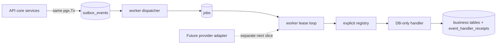

# Архитектура: durable dispatcher и PostgreSQL jobs

Дата: 2026-09-11. Статус: `draft`, ожидает DG-030-01.

## Контекст и границы

Модульный монолит продолжает иметь отдельные API/worker процессы. Эта vertical добавляет `internal/jobs` (queue/repository/registry/worker) и при необходимости `internal/outbox/dispatcher`, но не меняет core provider-neutral contract. PostgreSQL хранит durable state. Redis допускается лишь как будущий wake-up optimisation и не входит в correctness path.

## Stable model

### Migration 6

Additive migration creates:

- `job_status`: `pending`, `running`, `completed`, `dead`, `cancelled`;
- `jobs` based on SPEC-030 §6 with ID, `type`, `handler`, JSON payload, priority/run_at, attempts/max_attempts, optional dedup/event/correlation/causation IDs, lease fields and sanitized error fields;
- partial claim index `(priority, run_at, created_at) WHERE status='pending'`;
- partial running lease index and dead index;
- unique `(event_id, handler)` where event is non-null;
- `event_handler_receipts(event_id FK outbox_events ON DELETE CASCADE, handler, processed_at)` primary key.

`jobs_running_lease_consistency` requires worker identity, expiry and token only for `running`. Add checks for valid `max_attempts`/attempts and nonblank type/handler. Existing `outbox_events` survives upgrade unchanged.

The implementation may add a safe `dedup_key` active-job unique index only if its lifecycle/requeue contract is tested; it is not a substitute for event-handler uniqueness or business idempotency.

### Go boundaries

| Boundary | Responsibility | Must not do |
|---|---|---|
| `JobQueue.Enqueue(ctx, tx, request)` | Persist a job in caller transaction. | Start goroutine or call handler. |
| `Dispatcher.DispatchBatch(ctx, limit)` | Lock eligible outbox events with `FOR UPDATE SKIP LOCKED`, resolve explicit registered routes, insert job per route, set `dispatched_at`. | Mark no-route event dispatched; invoke external provider. |
| `Registry.Resolve(name)` | Resolve code-owned name to handler definition. | Reflection or accepting an untrusted function name. |
| `Repository.Claim/Complete/Reschedule/Recover` | Atomic lease state changes and fencing predicates. | Assume a stale worker owns a job. |
| `ReceiptRunner` | Wrap DB-only handler effect plus receipt in one transaction. | Claim external exactly-once semantics. |
| Worker runtime | Poll bounded batches, cap concurrency, derive bounded contexts and stop claims on shutdown. | Busy-loop or unbounded goroutines. |

## Transaction and state contracts

### Dispatch

Within one transaction, select each eligible undispatched event `FOR UPDATE SKIP LOCKED`; obtain its registered routes; `INSERT ... ON CONFLICT(event_id,handler) DO NOTHING`; only then set `dispatched_at`. The dispatcher must use a bounded batch. Events with no route follow DG-030-01 (provisionally retained undispatched).

### Claim/fencing

Claim uses CTE candidate ordered `priority ASC, run_at ASC, created_at ASC`, `FOR UPDATE SKIP LOCKED`, and atomically sets running fields plus a fresh token and increments attempts. Completion, retry/dead, extension and any ownership-sensitive mutation predicate on `(id, status='running', locked_by, lease_token)`. Zero affected rows maps to stable `stale_job_lease`, not success.

### Retry/recovery

A transient `JobError` yields `pending` job with cleared lease and `run_at > DB now`; delay is `min(maxDelay, base*2^(attempt-1))` plus bounded injected jitter (or trusted bounded RetryAfter). Permanent class or attempts reaching `max_attempts` yields `dead`, clears lease, stores sanitized code/message. Recovery atomically returns only expired running rows to pending and clears old token.

### Receipt

For a DB-only `domain_event` job, worker starts a transaction, locks/checks receipt by `(event_id, handler)`, runs the handler's DB mutation if absent, inserts receipt and commits. Only after that does it attempt fenced job completion. If process dies after receipt commit, reexecution observes receipt and produces no second DB effect.

## Failure semantics

| Point | Contract |
|---|---|
| Outbox event committed, worker down | Event remains undispatched. |
| First fan-out insert then transaction fails | Transaction rollback means no partial jobs/dispatch; replay is safe. |
| Second dispatcher races | Locks + `(event_id,handler)` ensure at most one durable job. |
| Claim then worker crash | Lease expiry/recovery enables a new claim. |
| Old lease completes after recovery/new claim | Fencing predicate updates zero rows. |
| DB handler effect after receipt boundary fails | Both effect and receipt rollback. |
| Receipt commits before job completion | Job may rerun; receipt turns DB-only repeated call into no-op. |
| Network send ambiguous | Out of scope; generic job does not mark Message sent/failed based on an ambiguous result. |

## Runtime and observability

Worker identity is generated per process (diagnostic, no credentials). Runtime uses configurable bounded poll interval/batch/concurrency and cancellation-aware shutdown: stop claims, allow active contexts until grace deadline, do not extend after deadline. It emits only low-cardinality handler/type/status metrics and redacted errors; no job payload/full text/secret is logged. Initial metrics: queue depth, oldest pending age, dispatch lag/count, lease expiry, retry/dead/completed totals.

## Implementation order

1. Migration/schema and SQL repository types.
2. RED integration tests for dispatch idempotency, claim/fencing/recovery, scheduled jobs and retry/dead.
3. Registry/dispatcher with an explicit test DB-only handler and receipt wrapper.
4. Worker loop/runtime integration and metrics/runbook.
5. Remote test, independent review, QA.
