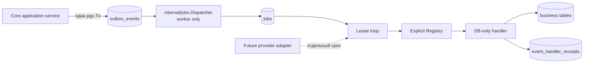
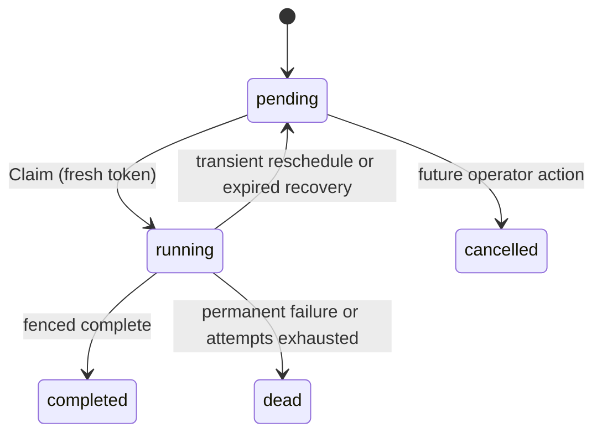

# Архитектура: durable dispatcher и PostgreSQL jobs

Дата: 2026-09-11. Статус: `ready_for_review`. Решение DG-030-01 принято: event без зарегистрированного route остаётся `undispatched`.

## Подтверждённая исходная точка и границы

Checkout уже содержит PostgreSQL `outbox_events`, запись domain event в той же `pgx.Tx`, отдельный процесс `cmd/worker` и пустой worker-runtime. `message.queued` означает durable provider-neutral intent; реальная отправка провайдеру в этот срез не входит. В checkout нет таблиц jobs/receipts, dispatcher или worker loop.

SPEC-030 добавляет только durable fan-out и выполнение DB-only работ. PostgreSQL остаётся единственным источником истины для event, job, lease и receipt. Redis может быть будущим сигналом пробуждения, но не хранит единственную копию работы и не участвует в correctness path. Внешние provider clients, credentials, webhook ingress, UI повторного запуска и планировщик SLA исключены.



## C4

### Context

Оператор/API создаёт business fact через core application service. Core фиксирует факт и provider-neutral outbox event. Worker асинхронно materializes зарегистрированных consumers в durable jobs и исполняет только доверенный код, зарегистрированный при запуске. PostgreSQL — trust boundary между API, несколькими worker instances и restart/crash. Внешние providers остаются за границей этой vertical.

### Containers

| Container | Назначение | Доверие и связь |
|---|---|---|
| API process | Вызывает core и сохраняет outbox event. | Не dispatch-ит и не выполняет job. |
| Worker process | Dispatcher, recovery и bounded lease loop. | Единственный процесс, который claim-ит/исполняет jobs. Несколько экземпляров допустимы. |
| PostgreSQL | Durable event/job/receipt и атомарные state changes. | Источник времени для persisted transition (`clock_timestamp()`/`now()` в SQL). |
| Future channel adapter | Внешняя отправка/reconciliation. | Не реализуется; future handler обязан иметь provider-specific idempotency. |

### Components and Go boundaries

`internal/jobs` — новый infrastructure/application package. Он зависит от `internal/platform/database`, `pgx`, logging/telemetry abstraction и `internal/outbox` event shape, но core не зависит от `internal/jobs` и не знает jobs/handlers.

| Component | Public contract | Транзакционная граница |
|---|---|---|
| `Registry` | Кодовая карта `event_type -> []Route` и `handler name -> Handler`; регистрация дубликата имени запрещена. Route и handler names — constants, не значения payload. | Нет БД. |
| `Dispatcher` | `DispatchBatch(ctx, limit) (DispatchResult, error)` materializes routes только для registered event types. | Одна короткая tx на bounded batch; event locks, job inserts и `dispatched_at` commit/rollback вместе. |
| `Repository` | `Claim`, `Extend`, `Complete`, `Reschedule`, `RecoverExpired`, query helpers. | Каждая state mutation — один bounded SQL statement/tx с fencing predicate. |
| `Worker` | `Run(ctx)` запускает dispatch, recovery и bounded job execution; `Stop` прекращает новые claims. | Не держит job-row lock во время handler работы. |
| `Handler` | DB-only effect для claimed `Job`; receives event ID and trusted route metadata. | `ReceiptRunner` открывает tx, проверяет receipt, выполняет effect и writes receipt atomically. |
| `ReceiptRunner` | Обёртка для `domain_event` DB-only handler. | Receipt plus business effect in one tx; completion идёт отдельной fenced mutation. |

Рекомендуемые минимальные Go types:

```go
type Route struct { EventType, Handler string }
type Registry interface {
    Routes(eventType string) []Route
    EventTypes() []string
    Resolve(handler string) (Handler, bool)
}
type Handler interface {
    Handle(context.Context, pgx.Tx, DomainEvent) error // DB-only
}
type JobError struct {
    Class FailureClass // transient | permanent
    Code, Message string // stable, sanitized, bounded
    RetryAfter *time.Duration
    Cause error // log only, never persisted verbatim
}
```

`DomainEvent` is read from canonical `outbox_events` by ID in the receipt transaction; job payload stores only `{event_id}`. It must not copy message text, provider payload, headers or credentials into `jobs.payload`. The handler is not passed a mutable `Job` persistence capability: job ownership operations remain in Repository.

## Data model and migration 6

Migration is additive: `000006_durable_jobs.up.sql` is registered after migration 5 in `internal/platform/database/migrations.go`; the paired down migration drops receipts, job indexes/table/type in reverse dependency order. Existing `outbox_events` schema/data is neither rebuilt nor modified destructively.

```sql
CREATE TYPE job_status AS ENUM ('pending','running','completed','dead','cancelled');

CREATE TABLE jobs (
  id uuid PRIMARY KEY,
  type text NOT NULL,
  handler text NOT NULL,
  payload jsonb NOT NULL DEFAULT '{}'::jsonb,
  status job_status NOT NULL DEFAULT 'pending',
  priority integer NOT NULL DEFAULT 100,
  run_at timestamptz NOT NULL DEFAULT now(),
  attempts integer NOT NULL DEFAULT 0,
  max_attempts integer NOT NULL DEFAULT 10,
  dedup_key text,
  event_id uuid REFERENCES outbox_events(id) ON DELETE CASCADE,
  locked_by text,
  locked_at timestamptz,
  lease_expires_at timestamptz,
  lease_token uuid,
  last_error_code text,
  last_error_message text,
  correlation_id uuid,
  causation_id uuid,
  created_at timestamptz NOT NULL DEFAULT now(),
  updated_at timestamptz NOT NULL DEFAULT now(),
  completed_at timestamptz,
  CONSTRAINT jobs_type_not_blank CHECK (length(btrim(type)) > 0),
  CONSTRAINT jobs_handler_not_blank CHECK (length(btrim(handler)) > 0),
  CONSTRAINT jobs_attempts_valid CHECK (attempts >= 0 AND max_attempts > 0 AND attempts <= max_attempts),
  CONSTRAINT jobs_running_lease_consistency CHECK (
    (status = 'running' AND locked_by IS NOT NULL AND locked_at IS NOT NULL
      AND lease_expires_at IS NOT NULL AND lease_token IS NOT NULL)
    OR (status <> 'running' AND locked_by IS NULL AND locked_at IS NULL
      AND lease_expires_at IS NULL AND lease_token IS NULL)
  )
);
CREATE INDEX jobs_claim_idx ON jobs(priority, run_at, created_at) WHERE status='pending';
CREATE INDEX jobs_running_lease_idx ON jobs(lease_expires_at) WHERE status='running';
CREATE INDEX jobs_dead_idx ON jobs(created_at) WHERE status='dead';
CREATE UNIQUE INDEX jobs_event_handler_uq ON jobs(event_id, handler) WHERE event_id IS NOT NULL;
CREATE UNIQUE INDEX jobs_type_dedup_active_uq ON jobs(type, dedup_key)
  WHERE dedup_key IS NOT NULL AND status IN ('pending','running');

CREATE TABLE event_handler_receipts (
  event_id uuid NOT NULL REFERENCES outbox_events(id) ON DELETE CASCADE,
  handler text NOT NULL,
  processed_at timestamptz NOT NULL DEFAULT now(),
  PRIMARY KEY (event_id, handler),
  CONSTRAINT event_handler_receipts_handler_not_blank CHECK (length(btrim(handler)) > 0)
);
```

The active dedup index is a convenience for independently scheduled jobs; `(event_id, handler)` is the fan-out duplicate guard and receipt is the DB-effect duplicate guard. `last_error_code` and `last_error_message` must be bounded stable/sanitized values; no wrapped database error, stack trace, payload or provider response is persisted.

## State, locks and fencing

### Job state machine



No completed/dead/cancelled job can be claimed. `attempts` increments exactly once at a successful claim, not at retry scheduling or recovery. A retry clears all lease fields and sets future `run_at`; recovery clears all lease fields and sets `run_at` to database current time.

### Canonical lock order

No transaction spans dispatcher and handler execution. The following order prevents cycles with existing core transactions:

1. Core mutation follows its existing aggregate locks and writes outbox in the same tx. It never accesses jobs/receipts.
2. Dispatcher locks `outbox_events` rows first, then inserts into `jobs`; it does not lock business aggregate rows or receipts.
3. Claim/recovery/lease operations lock only `jobs` rows.
4. Receipt execution locks/inserts `(event_id, handler)` receipt first, then the handler takes documented business-row locks in its own canonical order. It never locks a job row.
5. Fenced `Complete`/`Reschedule` runs after the receipt tx and locks only its job row.

The receipt transaction serializes duplicate executions of one route by first attempting `INSERT ... ON CONFLICT DO NOTHING` as its receipt guard, or equivalently locking the receipt key through an insert-savepoint pattern. It must not use an unlocked `SELECT` followed by handler effect. If the receipt already exists, handler effect is skipped and the worker proceeds to fenced completion.

### Dispatch under DG-030-01

The Registry exposes the finite `EventTypes()` it currently routes. Dispatcher selects only `outbox_events` whose `event_type` belongs to that explicit set, `dispatched_at IS NULL`, ordered by `created_at`, with `FOR UPDATE SKIP LOCKED` and a bounded limit. This keeps an unknown historical event visible and undispatched without head-of-line blocking registered event types.

For every locked event, routes are sorted by stable handler name, jobs are inserted with `type='domain_event'`, `{event_id}` payload, `event_id`, correlation and causation copied from the canonical event. It uses `ON CONFLICT (event_id, handler) WHERE event_id IS NOT NULL DO NOTHING`. It sets `dispatched_at` only after all routes are attempted in the same transaction. If no route is available (including registry reload/change during a batch), it does not set `dispatched_at`; the tx may commit no change for that row. `dispatched_at` is a durable fan-out marker, not handler completion.

### Claim and ownership-sensitive mutations

Claim uses a CTE selecting `pending AND run_at <= clock_timestamp()` ordered `(priority ASC, run_at ASC, created_at ASC) FOR UPDATE SKIP LOCKED`, then atomically sets `running`, worker identity, `locked_at`, `lease_expires_at`, fresh UUID `lease_token`, `attempts=attempts+1`, and `updated_at`. The caller receives the current token.

`Extend`, `Complete` and `Reschedule` predicate every mutation by `(id, status='running', locked_by, lease_token)`. They clear lease fields on terminal/requeued state. Zero affected rows returns stable `ErrStaleJobLease`; it never reports success or overwrites the newer owner. `RecoverExpired` updates only `status='running' AND lease_expires_at < clock_timestamp()`; it does not need the prior token because expiration has invalidated it.

## Handler, error and retry contract

A handler result is one of success, typed `JobError{transient}`, typed `JobError{permanent}`, or an unclassified error. Unclassified errors are transient with stable `internal_error` code and sanitized message; the original error may be logged through a redacting logger but is neither persisted nor exposed. Context cancellation caused by worker shutdown is transient and must not mark the job completed.

On success, a DB-only route commits business effect and receipt together, then calls fenced `Complete`. If that completion fails after receipt commit, a later execution sees the receipt and performs no duplicate DB effect. This is at-least-once processing, not external exactly-once.

For a transient failure, if post-claim `attempts < max_attempts`, `Reschedule` computes `min(maxDelay, baseDelay * 2^(attempts-1))` plus bounded injected jitter; a trusted `RetryAfter` is clamped to the same configured limits. When attempts reaches `max_attempts`, or error is permanent, it becomes `dead`. All time used for persisted comparison and transition comes from PostgreSQL, while delay calculation is deterministic/injectable for tests.

No generic job handler calls a provider or transitions an outbound Message in this slice. A future provider handler must separately define provider idempotency, ambiguous-result reconciliation and when `MarkSent`/`MarkFailed` is permitted.

## Runtime, shutdown and observability

Only `runtime.Run(ctx, worker=true)` constructs `Registry`, `Dispatcher`, `Repository` and `Worker`; API runtime remains free of job execution. Worker configuration adds validated, non-secret bounded settings for poll interval, dispatch/claim batch size, concurrency, lease duration, retry bounds and shutdown grace. Defaults must avoid a zero-delay loop; invalid zero/negative/unbounded values fail configuration validation without reporting their values.

A unique `hostname:pid:random` worker ID is diagnostic only. The loop first recovers expired jobs, dispatches a bounded batch, then claims no more than available semaphore capacity. Every database/handler operation inherits a bounded context. On cancellation it stops dispatcher and new claims, waits only until configured shutdown deadline for active handlers, and leaves unfinished claimed jobs uncompleted; recovery makes them eligible after expiry. Lease extension is stopped at that deadline.

Metrics/logs use low-cardinality labels (`handler`, `type`, `outcome`) and stable error code. Required signals: pending depth, oldest pending age, undispatched routed-event age/count, dispatch count/lag, claimed/completed/retried/dead totals, lease recoveries and stale-lease outcomes. Do not label or log IDs, payload, text, headers, provider response, credentials, DSN or error causes. Readiness of worker remains PostgreSQL/required dependency health; it must not report a dead job as healthy completion.

## Failure modes and rollback

| Failure | Required result | Recovery |
|---|---|---|
| Core tx rolls back | No domain mutation and no event. | Existing core rule. |
| Event commits while worker is down | Event remains undispatched. | Dispatcher later fan-outs it. |
| Dispatcher crashes before commit | No visible partial fan-out/marker. | Re-dispatch safely. |
| Dispatcher races | Outbox locks plus unique `(event_id,handler)` leave one job. | Other worker skips/observes dispatched marker. |
| Unknown event route | No job, no receipt, no `dispatched_at`. | Register route; later dispatch processes retained history. |
| Worker dies after claim | `running` job remains until expiry. | `RecoverExpired`, fresh lease/token. |
| Stale worker mutates job | Fencing affects zero rows. | Return `ErrStaleJobLease`, preserve current owner. |
| Handler tx fails | Effect and receipt both roll back. | Retry/dead policy. |
| Receipt commits, completion fails | Job can run again; effect is skipped by receipt. | Fenced completion on later lease. |
| Migration/deploy rollback | Migration 6 down only after worker stopped and no requirement to retain jobs/receipts. | Normal production rollback is forward-compatible application rollback; do not run destructive down migration on a populated shared dev/prod DB. |

## Verification and implementation order

1. Add migration 6 plus registry/repository types; remote RED integration tests prove missing schema/API first.
2. Prove fan-out/idempotency and DG-030-01 retention against PostgreSQL concurrency.
3. Prove claim, fencing, scheduled eligibility, retry/dead and expired recovery through integration tests.
4. Add one registered DB-only test handler and receipt crash boundary tests; do not add provider send.
5. Wire worker-only runtime and bounded shutdown; expose redacted metrics.
6. Run CI/dev deployment, remote migration, `go test -race ./tests/integration`, full coverage, `go vet`, `gofmt`, independent review and QA.

Migration 6 is backward-compatible for the current application: old API/worker code ignores new tables. New worker code must tolerate an empty registry and leaves every unregistered event undispatched per DG-030-01. Application rollback after migration is therefore safe; schema downgrade is an explicit maintenance operation only.
