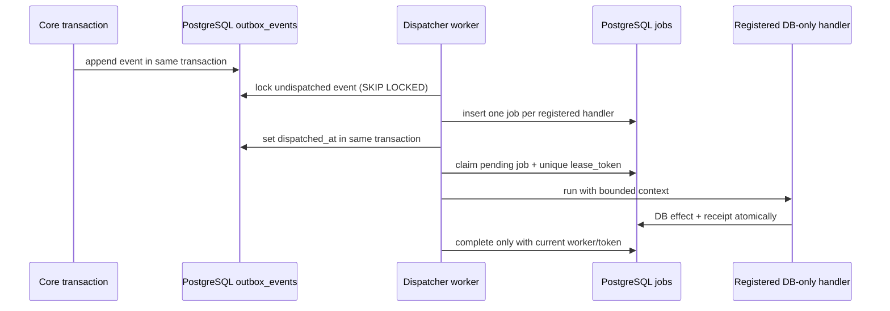

# Исследование: SPEC-030 Durable Jobs и transactional outbox

Дата: 2026-09-11. Статус: `ready_for_review`.

## Граница исследования

Проверены `spec/030-events-jobs-outbox.md`, существующие миграции, `internal/outbox`, core-сервисы, worker runtime и integration tests. Этот срез реализует только durable dispatcher и job runtime: PostgreSQL jobs, явный registry, fan-out outbox events, leasing/fencing, retry/recovery и transaction-bound receipt для DB-only handlers. В него не входят webhook ingress, реальные email/другие provider adapters, их credentials, UI, scheduled SLA и analytics.

## Подтверждённые факты checkout

| Источник | Подтверждённый факт | Следствие для SPEC-030 |
|---|---|---|
| `db/migrations/000003_core_outbox.up.sql` | Есть `outbox_events`, включая `dispatched_at` и индексы undispatched/aggregate. | Миграция 6 добавляет только jobs и receipts; существующий outbox не пересоздаётся. |
| `internal/outbox/outbox.go` | `outbox.Writer.Append` пишет event через переданный `pgx.Tx`. | Atomic domain mutation + event уже реализована и остаётся неизменной. |
| `internal/core/inbound.go`, `conversation_transitions.go`, `outbound.go` | Committed domain facts включают `message.received`, `message.queued`, `message.sent`, `message.failed`, conversation events. | Dispatcher обязан быть generic по event type; payload использует IDs, а не provider models. |
| `internal/platform/runtime/runtime.go` | Процесс с `worker=true` уже идентифицируется как `support-worker`, но job-loop ещё не запущен. | Новый runtime подключается только к worker process; API не выполняет jobs. |
| `internal/platform/database/database.go` | `database.Pool` предоставляет PostgreSQL transaction boundary. | Job repository/dispatcher/receipt используют PostgreSQL и явные транзакции. |
| `spec/030-events-jobs-outbox.md` §§3, 9–16, 21–26 | Нормативны PostgreSQL durability, `FOR UPDATE SKIP LOCKED`, unique `(event_id,handler)`, lease token, at-least-once и receipt. | Redis не является очередью, reflection/произвольные handler names исключены, external exactly-once не заявляется. |

## As-is

Доменная мутация сохраняет outbox event транзакционно, но после commit он остаётся undispatched: jobs table, dispatcher, handler registry, lease/retry/recovery и receipt отсутствуют. Worker process живёт как runtime role, но не обрабатывает persisted work. Поэтому `message.queued` — durable intent, ещё не provider-send.

## To-be в этой vertical

## Scope boundary and research result

| Capability | Result in this task | Explicitly deferred |
|---|---|---|
| Durable event fan-out | Yes: bounded dispatcher transaction and unique `(event_id, handler)` creation. | Inbound persistence/enqueue (SPEC-030 §18) and provider webhook parsing. |
| Job ownership | Yes: `pending/running/completed/dead/cancelled`, lease expiry, unique lease token, stale fencing. | Arbitrary distributed workflow engine. |
| Retry | Yes: typed transient/permanent failure, bounded exponential backoff with jitter, max-attempt dead state. | Provider-specific error mapping and provider `Retry-After` semantics unless a future adapter supplies it. |
| Idempotent DB-only consumption | Yes: receipt and handler DB effects in one transaction. | Exactly-once network side effects. |
| `message.queued` provider send | No. It may be a future registered handler, but no real provider call occurs here. | Email/Telegram/VK/MAX adapter, credentials, attempt/reconciliation. |
| Observability | Minimal operational counters/log-safe errors may be added with worker; payloads/secrets never logged. | Full dashboard/alerts and SLA analytics. |

## Risks and gates

1. **Initial production event routing.** Existing outbox contains event types but provider send is deliberately absent. Marking an event dispatched with zero registered handlers would lose automatic future fan-out; treating it as a generic permanent error creates artificial dead work. Recommended contract: dispatcher selects only event types with at least one explicitly registered durable handler; events with no route remain undispatched, are observable, and are processed after a later handler registration. This needs architect confirmation before implementation.
2. **Receipt applicability.** Receipts prove at-most-once DB effects only when handler effect and receipt share one PostgreSQL transaction. They cannot prove external delivery. The worker must state this in public errors/logs and documentation.
3. **Retry determinism.** Random jitter must be injectable or bounded in tests; production must not create a zero-delay retry storm.
4. **Lease duration/runtime lifecycle.** Lease must be handler-aware/configurable and cancellation/shutdown must cease new claims; no unbounded goroutine/job.
5. **Schema rollback.** Migration adding jobs/receipts must be additive and must not drop pre-existing outbox facts in normal upgrade.

## Recommended next role

Архитектор должен подтвердить routing rule for events without registered handlers and exact package/runtime boundary, then разработчик can start RED tests and migration 6.
